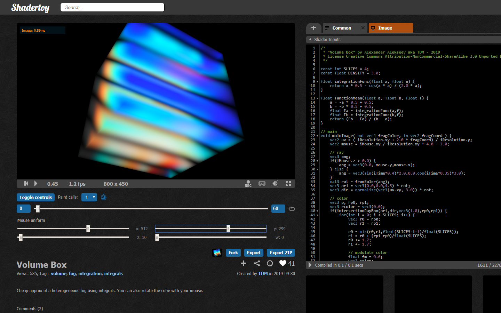
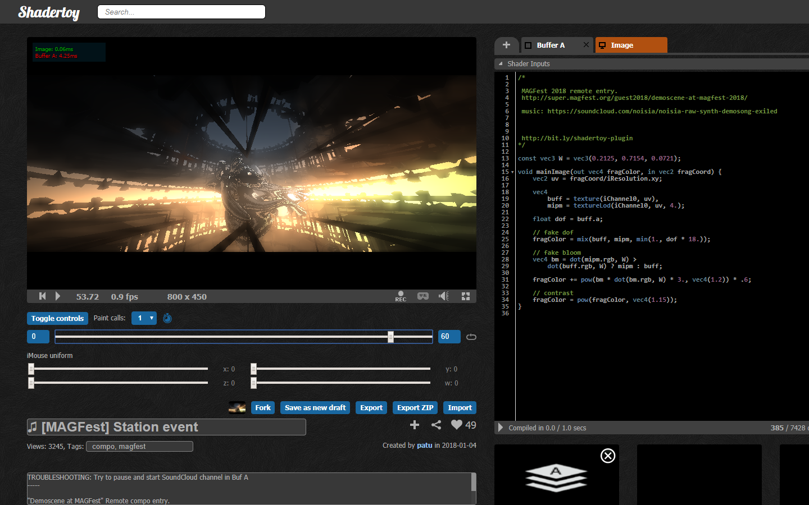
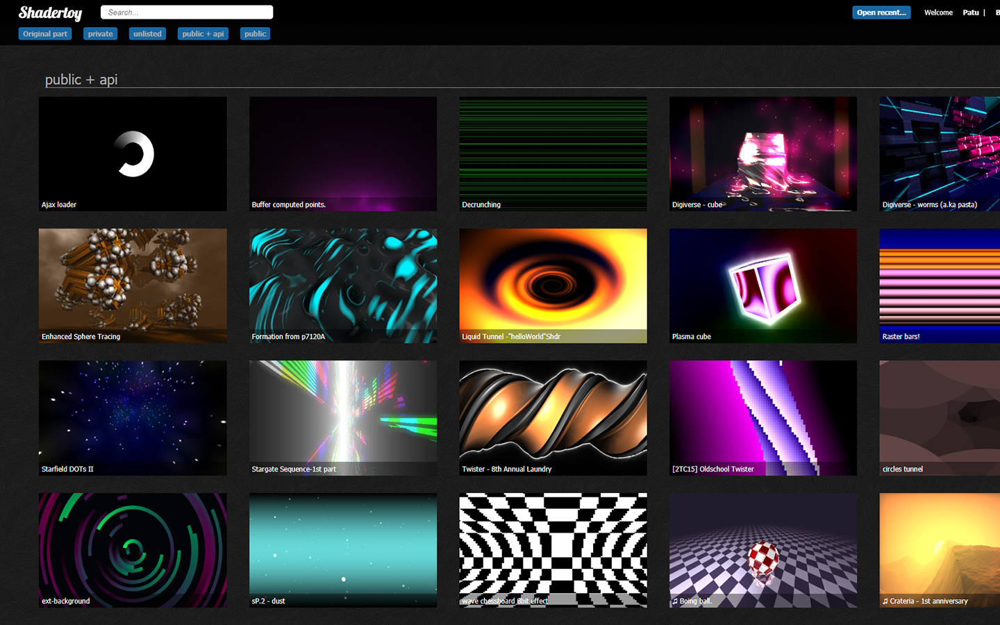
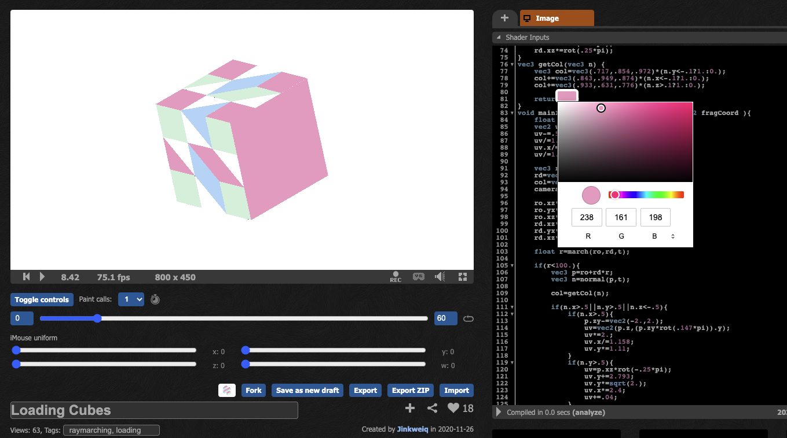
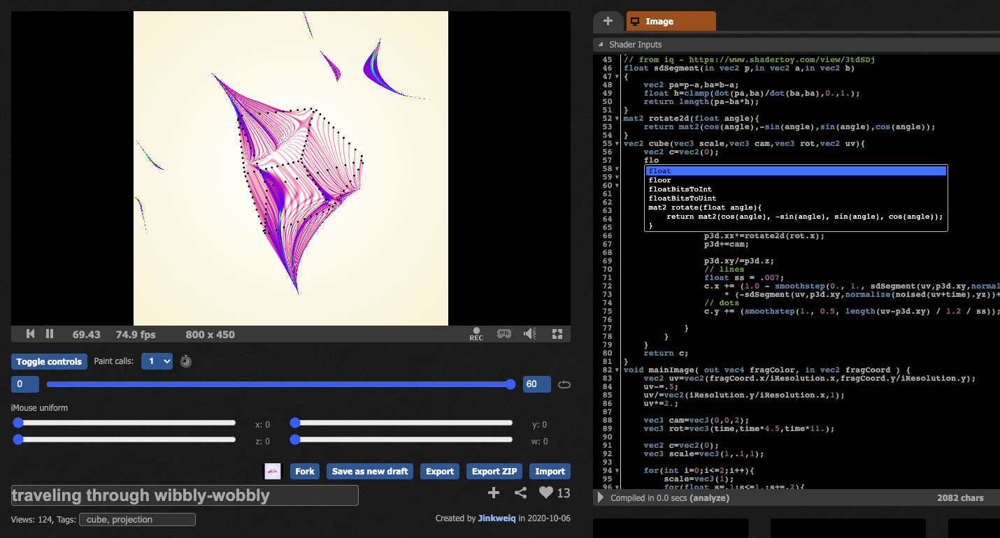
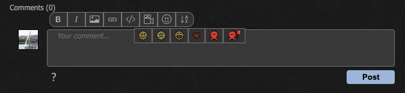

# ShaderToy unofficial plugin.

ShaderToy unofficial plugin is a web extension designed to enhance the coding experience for users of Shadertoy.

# Installing:

## Stores:

[Chrome extension](https://chrome.google.com/webstore/detail/shadertoy-unofficial-plug/ohicbclhdmkhoabobgppffepcopomhgl?hl=pl)

[Firefox add-on](https://addons.mozilla.org/en-US/firefox/addon/shadertoy-unofficial-plugin/)

[Microsoft Edge extension](https://microsoftedge.microsoft.com/addons/detail/mjcddpebilehgjibahdplabcocgpfmdb)

## Manual installation

Download latest **zip** from [Releases](https://github.com/patuwwy/ShaderToy-Chrome-Plugin/releases)

## Google Chrome

1. Download the extension from the provided link and unzip it.
2. Open Chrome and go to `chrome://extensions/`.
3. In the top right corner, enable developer mode.
4. Drag and drop downloaded file.

## Mozilla Firefox

1. Download the extension from the provided link and unzip it.
2. Open Firefox and go to `about:debugging`.
3. Click `This Firefox`.
4. Click `Load Temporary Add-on…` and select the manifest.json file in the folder with the unpacked extension.

## Microsoft Edge

1. Download the extension from the provided link and unzip it.
2. Open Edge and go to `edge://extensions/`.
3. In the top right corner, enable developer mode.
4. Click `Load unpacked` and select the folder with the unpacked extension.

# Privacy Policy

Privacy policy is available [here](https://github.com/patuwwy/ShaderToy-Chrome-Plugin/blob/master/PRIVACY-POLICY.md)

## Contribution:

Please report bugs and request features [here](https://github.com/patuwwy/ShaderToy-Chrome-Plugin/issues).

Please add issue with description before PR.

## Features:

-   **Custom parameters** -
    [See documentation](./docs/custom-params.md)

-   **Fork** any shader.

-   **GPU render timers** (EXT_disjoint_timer_query_webgl2).

-   Adjustable slider for **full control of 'iTime'** uniform and audio/video channels' time.

-   Save as new draft (for owned shaders).

-   Four sliders for **simulating mouse position**.
    This can be used to tweaking variables with iMouse.xyzw uniform.

-   ~~Switchable dark color theme.~~
    (feature removed - implemented natively in Shadertoy)

-   ~~Sorting shaders list by views, likes or comments on "My profile" page.~~
    (feature removed - implemented natively in Shadertoy)

-   Alternative shaders list on profile page. ~~(chrome only)~~

-   ~~Shaders previews on "My profile" page.~~
    (feature removed - implemented natively in Shadertoy. Big preview on mouse over is still available)

-   **Change resolution** in windowed and fullscreen mode by pressing keys ALT + 1...9.

    Resolution is divided by pressed key value, for example:

    Key '2' divides by 2, 1920x1080 becomes 960x540.
    Key '8' divides by 8, 1920x1080 becomes 240x135.

    This allows to run shaders smoothly (even in fullscreen) on non-top GPUs.
    ~~Notice that lower resolution is interpolated to original size. This causes blurrish rendering.~~
    Notice, antialiasing is enabled by default on Shadertoy WebGL canvas.
    For "pixelated" image, rendering mode switch has been added in extension's popup (click on green S icon) ~~(chrome only)~~.

-   Take HQ screenshot. Screenshot resolution is 2 \* current resolution (including current resolution divider). 1920x1080 becomes 3840x2160.

-   Pause/Restart in fullscreen mode.

-   Fullscreen edit mode.

-   **Export shaders** (single JSON or ZIP archive with JSON and readme.txt).

-   Import JSON.

-   **Show links** in description/comments even if not inserted with BBCode.

-   ~~Show current canvas resolution~~ ~~on FPS hover~~
    (feature removed - implemented natively in Shadertoy)

-   **Render call multiplier**.

-   **Loop** in set time range (including video/audio channels).

-   **Open recent** - Quick access to recently viewed own shaders.

-   Shader preview (automatic generated image).

-   **Code completion** for glsl keywords in the code editor.

-   **Color picker** for any vec3 with r,g,b values in the code editor.

## Screenshots

### Controls

##### Setting iMouse.xyzw uniform:



##### Setting iTime uniform. You can set the start and end time range and toggle loop:



---

### Alternative shader list on profile page

##### Displays your shaders, grouped by status, as a lists of images with title:



---

### Info popup

##### Key bindings, render mode and alternate profile page switch:


---

### Code editor

##### Color picker for any vec3 with r,g,b



##### Code completion for glsl keywords and code snippets



##### BBCode buttons to make writing comments easier



---

## Author / Contact:

[PatrykFalba (Patu)](http://patrykfalba.pl)

## Contributors:

[movAX13h](http://blog.thrill-project.com/)

[cxw42](https://github.com/cxw42)

[Ethan Lowenthal](https://ethansawesomewebsite.tk/)

Render timing based on [shadertoy_gpu_timing.user.js](https://github.com/andrei-drexler/shadertoy-userscripts/blob/master/shadertoy_gpu_timing.user.js) by [Andrei Drexler](https://github.com/andrei-drexler)

## Beer? Sure.

If you find this extension useful, I'd love to hug a beer [PayPal](https://www.paypal.com/cgi-bin/webscr?cmd=_s-xclick&hosted_button_id=VDFNBT9N3ANHW&source=url). :beer:

```
int totalBeers = 3;
```

## Changelog:

Most recent changelog is [here](https://github.com/patuwwy/ShaderToy-Chrome-Plugin/blob/master/CHANGELOG.md).
