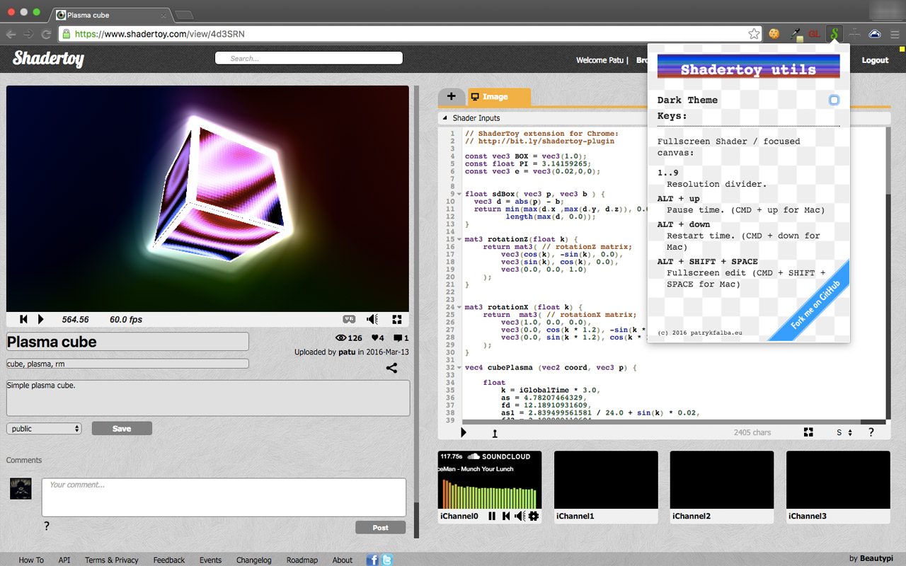

# ShaderToy unofficial plugin.

[Chrome Web Store](https://chrome.google.com/webstore/detail/shadertoy-unofficial-plug/ohicbclhdmkhoabobgppffepcopomhgl?hl=pl)

## Features:

* Switchable dark color theme.

* Sorting shaders list by views, likes or comments on "My profile" page.

* Change resolution in windowed and fullscreen mode by pressing keys 1...9.

  Resolution is divided by pressed key value, for example:

  Key '2' divides by 2, 1920x1080 becomes 960x540.
  Key '8' divides by 9, 1920x1080 becomes 240x135.

  This allows to run shaders smoothly (even in fullscreen) on non-top GPUs.
  Notice that lower resolution is interpolated to original size. This causes blurrish rendering. For pixelated image, rendering mode switch has been added.

* Pause/Restart in fullscreen mode.

* Fullscreen edit mode.

# ShaderToy extension changelog:

* 0.3.2
Minor update.
CSS fix for showing user picture on [Profile page](https://www.shadertoy.com/profile) (both themes)
Extension opens changelog on update/first install.

* 0.3.1
Exclude running shader on login page.
Added Chrome rendering mode select.

* 0.3.0
Refactoring.
Switchable dark theme.
Extension styling.
Dark theme fixes.

* 0.2.5
Show plugin popup only when on Shadertoy.com.

* 0.2.3
Added sort shaders by views/likes/comments on "My profile" page.

* 0.2.2
Git

* 0.2.1
JSDoc

* 0.2.0
Basic implementation of fullscreen edit

* 0.1.1
Added pause/restart time in fullscreen mode

* 0.1.0
Added basic dark theme

* 0.0.1
Change resolution by keys 1...9

[Amiga fonts](https://github.com/rewtnull/amigafonts) are used here.
