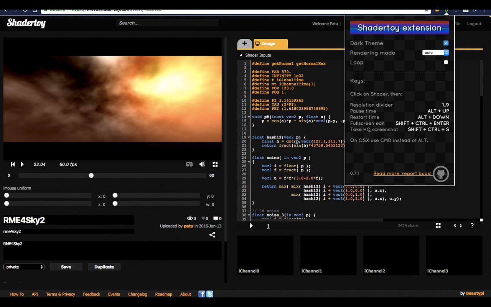
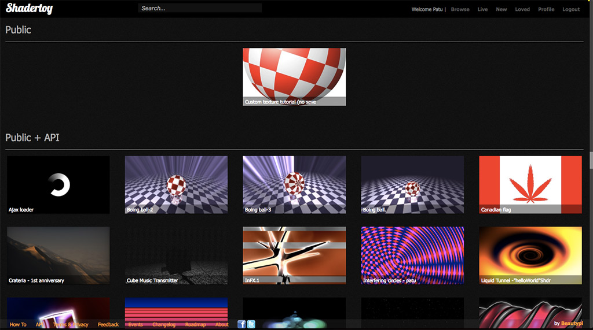
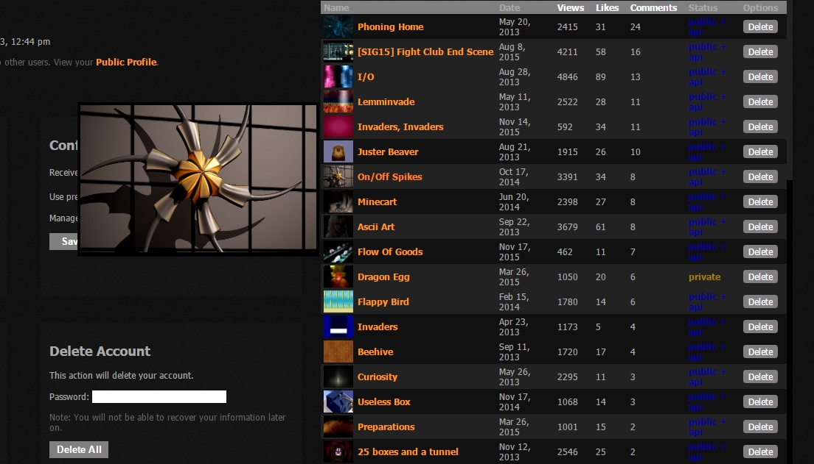

# ShaderToy unofficial plugin.

Extension to make Shadertoy coding more comfortable.
[Chrome Web Store](https://chrome.google.com/webstore/detail/shadertoy-unofficial-plug/ohicbclhdmkhoabobgppffepcopomhgl?hl=pl)

## Info

Please report bugs and request features [here](https://github.com/patuwwy/ShaderToy-Chrome-Plugin/issues)

## Features:

* Fork any shader.

* Save as new draft (for owned shaders).

* Adjustable slider for full control of 'iTime' uniform and audio/video inputs.

* Four sliders simulating mouse position with the same range.
  This can be used to tweaking variables with iMouse.xyzw uniform.

* ~~Switchable dark color theme.~~
(feature removed - implemented natively in Shadertoy)

* ~~Sorting shaders list by views, likes or comments on "My profile" page.~~
(feature removed - implemented natively in Shadertoy)

* Alternative shaders list on profile page.

* ~~Shaders previews on "My profile" page.~~
(feature removed - implemented natively in Shadertoy. Big preview on mouse over is still available)

* Change resolution in windowed and fullscreen mode by pressing keys 1...9.

  Resolution is divided by pressed key value, for example:

  Key '2' divides by 2, 1920x1080 becomes 960x540.
  Key '8' divides by 9, 1920x1080 becomes 240x135.

  This allows to run shaders smoothly (even in fullscreen) on non-top GPUs.
  Notice that lower resolution is interpolated to original size. This causes blurrish rendering. For pixelated image, rendering mode switch has been added.

* Take HQ screenshot. Screenshot resolution is 2 * current resolution (including current resolution divider). 1920x1080 becomes 3840x2160.

* Pause/Restart in fullscreen mode.

* Fullscreen edit mode.

* Export shaders (single JSON or ZIP archive with JSON and readme.txt)

* Import JSON

* Show links in description/comments even if not inserted with BBCode.

## Screenshots

Preview images on profile page with detail overlay on mouse hover

Alternative shader list

Fullscreen edit ~~(dark theme)~~

## ShaderToy extension changelog:

* 0.9.11
Export to ZIP by [Chris White cxw42](https://github.com/cxw42)

* 0.9.10 (10-Jan-2018)
Alternative Profile page hot fix.

* 0.9.8 (27-Nov-2017)
[issue#40](https://github.com/patuwwy/ShaderToy-Chrome-Plugin/issues/40)
[issue#41](https://github.com/patuwwy/ShaderToy-Chrome-Plugin/issues/41)

* 0.9.7 (24-Nov-2017)
Forked shader's banner. [issue#40](https://github.com/patuwwy/ShaderToy-Chrome-Plugin/issues/40)

* 0.9.6 (10-Nov-2017)
Fix for 'private' -> 'unlisted' change.
Key bindings change.

* 0.9.5 (20-Oct-2017)
Fixed font color for auto-links.
Fixed shader titles on tiles.

* 0.9.4 (7-Oct-2017)
Make links for URLs if not inserted with BBCode in description and comments.

* 0.9.3 (6-Oct-2017)
Foldable controls.
Extension's buttons colorized.

* 0.9.2 (2-Sep-2017 at Riverwash party)
Clone any shader.

* 0.9.1 (13-Aug-2017)
Removed shader preview in shaders list on profile page. (Provided natively in ShaderToy now).
Removed "tabs" permission (browser history).

* 0.9.0 (06-Aug-2017)
Export/Import shader (JSON) by [movAX13h](http://blog.thrill-project.com/)
Backup all user's shaders (JSON) by [movAX13h](http://blog.thrill-project.com/)
Bigger shaders list on Profile page.
Redirect to login page when user visit own profile but is not logged anymore.
Code style clean up.

* 0.8.4 (04-Aug-2017)
Rewind/Forward with arrow keys when shader is active.
Removed shaders sorting on Profile page (Sorting is provided natively in ShaderToy now).
Minor fixes.

* 0.8.3
On/Off record with CTRL + SHIFT + R (for fullscreen).
Fixed taking screenshot.

* 0.8.2
Clean up.

* 0.8.1
Dark theme removed. Dark theme has been implemented in ShaderToy.

* 0.8.0
Alternative profile page - new shaders list.
New shaders list option added to extension's popup.
Code structure changed. Dedicated JS module for profile page.

* 0.7.7
Cloned shader is saved as draft.
Dark theme dialog buttons colors fixed.

* 0.7.6
Loop switch fix.

* 0.7.5
Correct value for iFrame uniform.

* 0.7.4
Confirm shader cloning when original shader has not been saved

* 0.7.2
Cloning own shaders. No more copying uniforms and passes by hand.
Images for Github preview removed. One image added.

* 0.7.1
Time looping.

* 0.7.0
HQ Screenshot
Code cleanup
Minor style changes

* 0.6.3
Dark theme updated.
Shaders preview on profile page updated.

* 0.6.2
iMouse uniform sliders fix for paused state.
Sliders initial value.
Change in extension popup appearance.
Dark theme update.

* 0.6.0
iMouse uniform sliders.

* 0.5.1
Minor changes. Nothing new. Mostly code styling.

* 0.5.0
Added preview images on profile page.

* 0.4.1
Changed key bindings.
Changes in popup (show version, ui).
Removed Google Analytics (can not manage how to make it work ;)
Removed open github page when updated.

* 0.4.0
Timebar added.

* 0.3.3
Take screenshot in current resolution.
Fullscreen edit mode key changed to SHIFT + SPACE.
Google Analytics added.
Moved preview screens to screenshots folder.

* 0.3.2
CSS fix for showing user picture on [Profile page](https://www.shadertoy.com/profile) (both themes)
Extension opens changelog on update/first install.

* 0.3.1
Exclude running extension on login page.
Added Chrome rendering mode select.

* 0.3.0
Refactoring.
Switchable dark theme.
Extension styling.
Dark theme fixes.

* 0.2.5
Show plugin popup only when on Shadertoy.com.

* 0.2.3
Added sort shaders by views/likes/comments on "My profile" page.

* 0.2.2
Git

* 0.2.1
JSDoc

* 0.2.0
Basic implementation of fullscreen edit

* 0.1.1
Added pause/restart time in fullscreen mode

* 0.1.0
Added basic dark theme

* 0.0.1
Change resolution by keys 1...9

## Contact

[here](http://patrykfalba.eu)

## Contributors:

[movAX13h](http://blog.thrill-project.com/)
[Chris White cxw42](https://github.com/cxw42)
