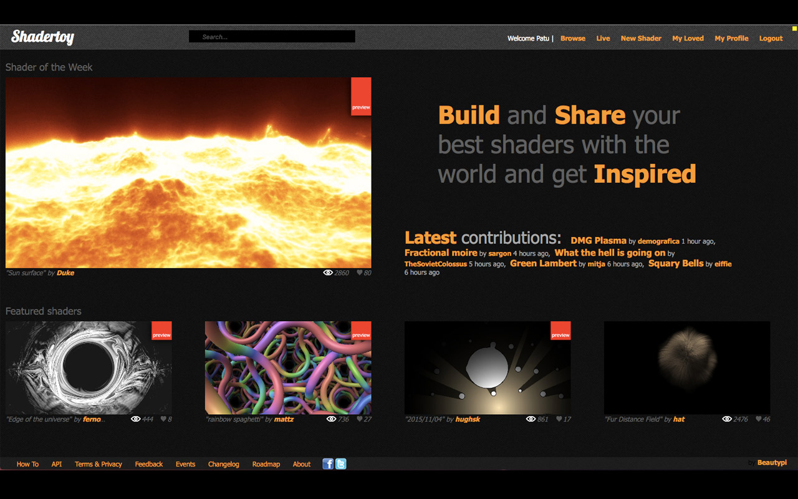
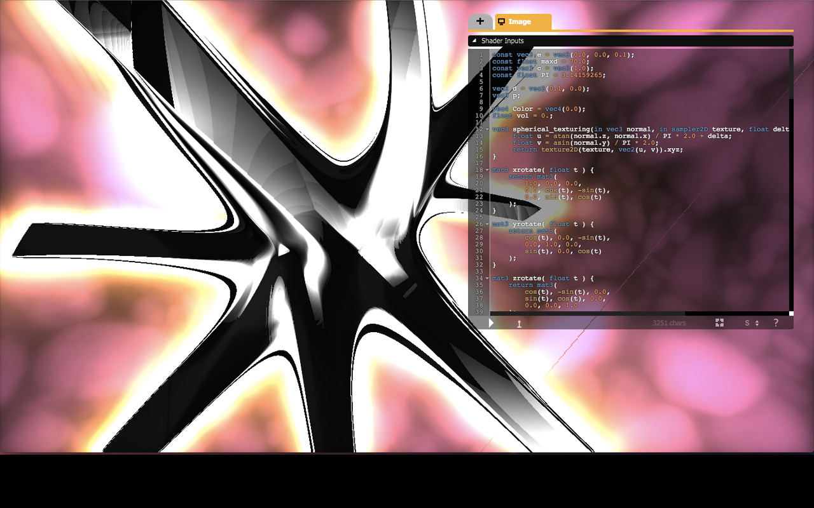
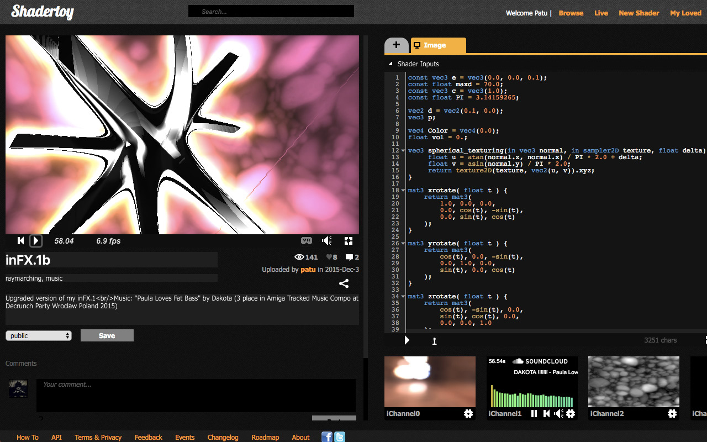

# ShaderToy unofficial plugin.

[Chrome Web Store](https://chrome.google.com/webstore/detail/shadertoy-unofficial-plug/ohicbclhdmkhoabobgppffepcopomhgl?hl=pl)

## Features:

* Sorting shaders list by views, likes or comments on "My profile" page.

* Change resolution in windowed and fullscreen mode by pressing keys 1...9
  Resolution is devided by pressed key value, for example:

  Key '2' divides by 2, 1920x1080 becomes 960x540.
  This allows to run shaders smoothly on non-top GPUs.

* Pause/Restart in fullscreen mode.

* Fullscreen edit mode.

* Dark color theme.

# Changelog:

* 0.2.5
Show plugin popup only when on Shadertoy.com.

* 0.2.3
Added sort shaders by views/likes/comments on "My profile" page.

* 0.2.2
Git

* 0.2.1
JSDoc

* 0.2.0
Basic implementation of fullscreen edit

* 0.1.1
Added pause/restart time in fullscreen mode

* 0.1.0
Added basic dark theme

* 0.0.1
Change resolution by keys 1...9
