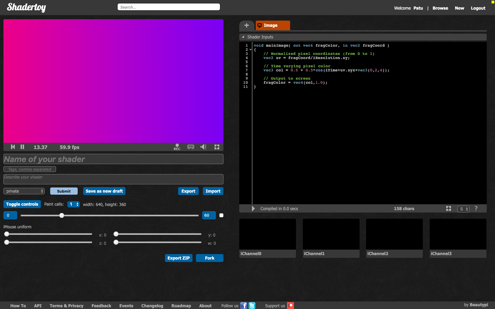
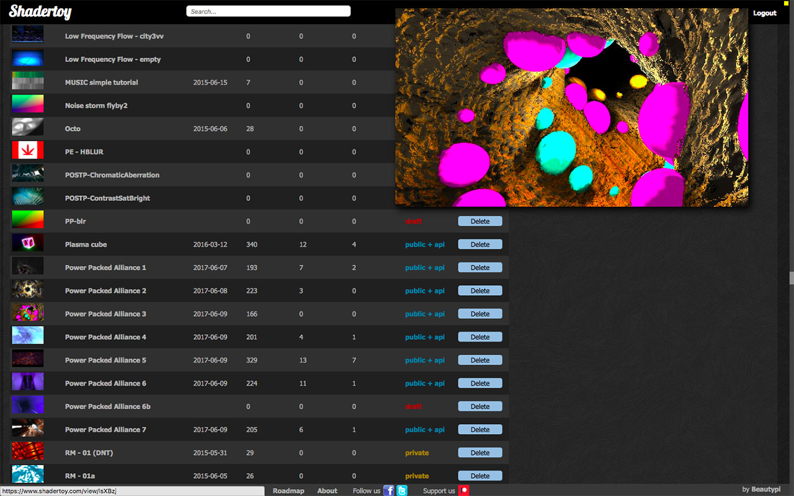
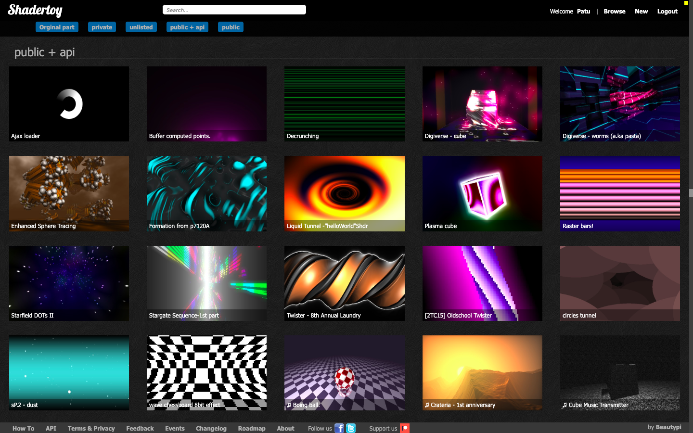
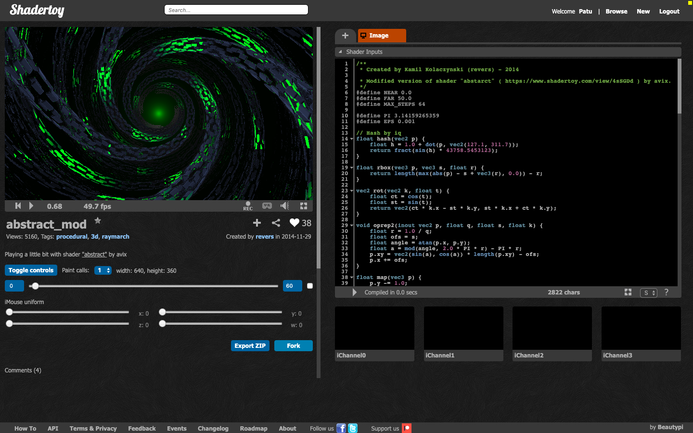

# ShaderToy unofficial plugin.

**WebExtension** to make **Shadertoy** coding more comfortable.

[Chrome extension](https://chrome.google.com/webstore/detail/shadertoy-unofficial-plug/ohicbclhdmkhoabobgppffepcopomhgl?hl=pl)

[Firefox add-on](https://addons.mozilla.org/en-US/firefox/addon/shadertoy-unofficial-plugin/) (not fully functional. WIP)

## Info

Please report bugs and request features [here](https://github.com/patuwwy/ShaderToy-Chrome-Plugin/issues).

## Features:

-   Fork any shader.

-   Save as new draft (for owned shaders).

-   Adjustable slider for full control of 'iTime' uniform and audio/video channels' time.

-   Four sliders for simulating mouse position.
    This can be used to tweaking variables with iMouse.xyzw uniform.

-   ~~Switchable dark color theme.~~
    (feature removed - implemented natively in Shadertoy)

-   ~~Sorting shaders list by views, likes or comments on "My profile" page.~~
    (feature removed - implemented natively in Shadertoy)

-   Alternative shaders list on profile page.

-   ~~Shaders previews on "My profile" page.~~
    (feature removed - implemented natively in Shadertoy. Big preview on mouse over is still available)

-   Change resolution in windowed and fullscreen mode by pressing keys ALT + 1...9.

    Resolution is divided by pressed key value, for example:

    Key '2' divides by 2, 1920x1080 becomes 960x540.
    Key '8' divides by 8, 1920x1080 becomes 240x135.

    This allows to run shaders smoothly (even in fullscreen) on non-top GPUs.
    Notice that lower resolution is interpolated to original size. This causes blurrish rendering. For pixelated image, rendering mode switch has been added in extension's popup (click on green S icon).

-   Take HQ screenshot. Screenshot resolution is 2 \* current resolution (including current resolution divider). 1920x1080 becomes 3840x2160.

-   Pause/Restart in fullscreen mode.

-   Fullscreen edit mode.

-   Export shaders (single JSON or ZIP archive with JSON and readme.txt).

-   Import JSON.

-   Show links in description/comments even if not inserted with BBCode.

-   ~~Show current canvas resolution~~ ~~on FPS hover~~
    (feature removed - implemented natively in Shadertoy)

-   Render call multiplier.

-   Loop in set range (including video/audio channels).

-   List of recently viewed own shaders.

## Screenshots

### Controls:

---

### Preview images on profile page on mouse hover:

---

### Alternative shader list:

---

### Fork any shader:

---

### Info popup (+ render mode):

---

## Contact

[PatrykFalba (Patu)](http://patrykfalba.pl)

## Contributors:

[movAX13h](http://blog.thrill-project.com/)

[Chris White cxw42](https://github.com/cxw42)

## Beer? Sure.

[PayPal](https://www.paypal.com/cgi-bin/webscr?cmd=_s-xclick&hosted_button_id=VDFNBT9N3ANHW&source=url)

## Changelog

[changelog](https://github.com/patuwwy/ShaderToy-Chrome-Plugin/blob/master/CHANGELOG.md)
