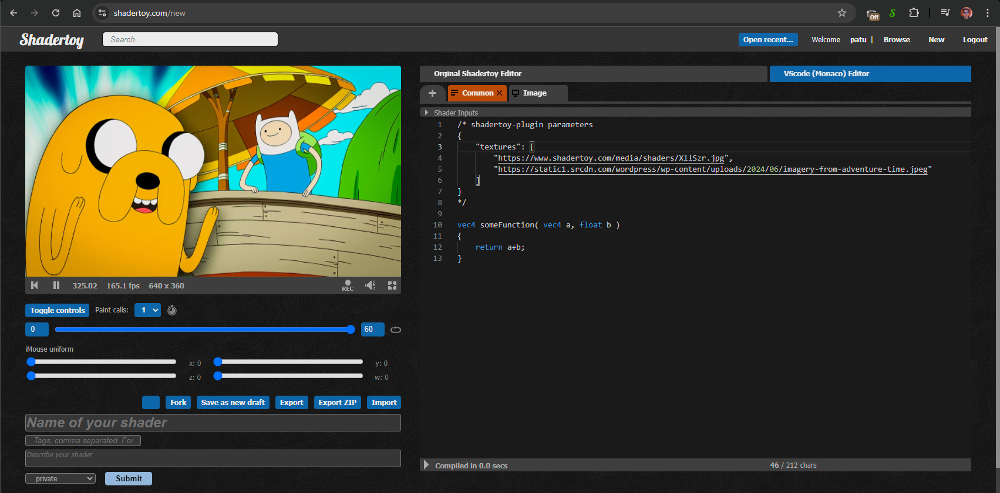
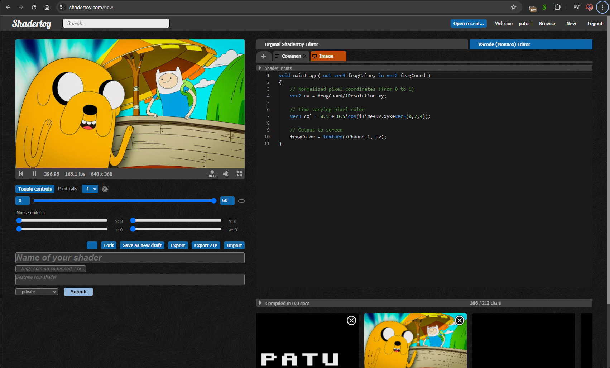

# Custom parameters

## Custom textures

Replaces textures in `Image` tab.

Example:

common tab:

```
/* shadertoy-plugin parameters
{
    "textures": [
        "https://www.shadertoy.com/media/shaders/XllSzr.jpg",
        "https://i.postimg.cc/Y98KxTJm/16c834b69c07d3ca51f6deb2ca47df8c.jpg"
    ]
}
*/
```

:exclamation: Image MUST be served with HTTP `Access-Control-Allow-Origin: *` header or from the same domain (www.shadertoy.com). You can use various images hosting service (imgur, giphy, postimages)

:+1: Base64 encoded URL is allowed

:-1: Gifs are not animated




## Canvas

### Size

```
/* shadertoy-plugin parameters
{
    "canvas": {
        "width": 800,
        "height": 800
    }
}
*/
```


